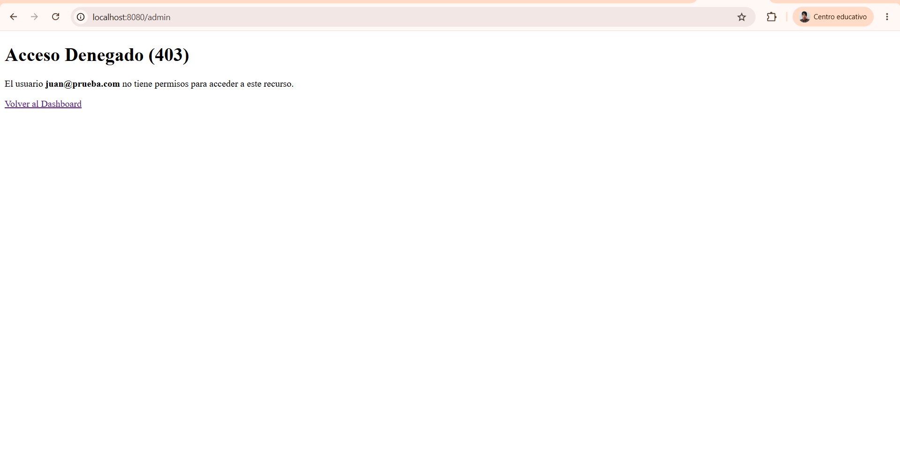
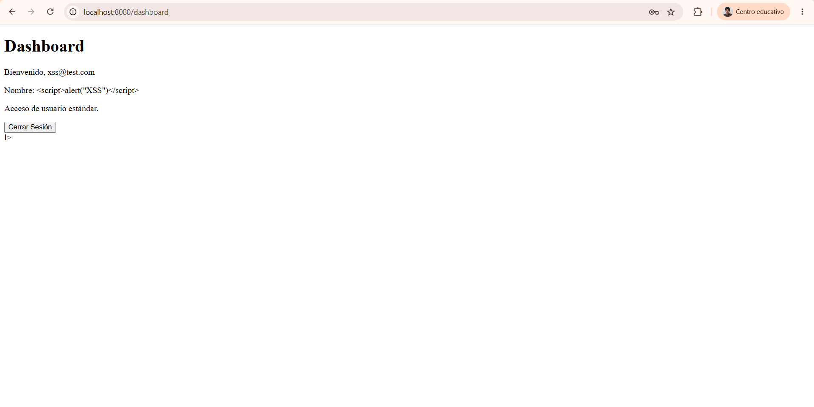
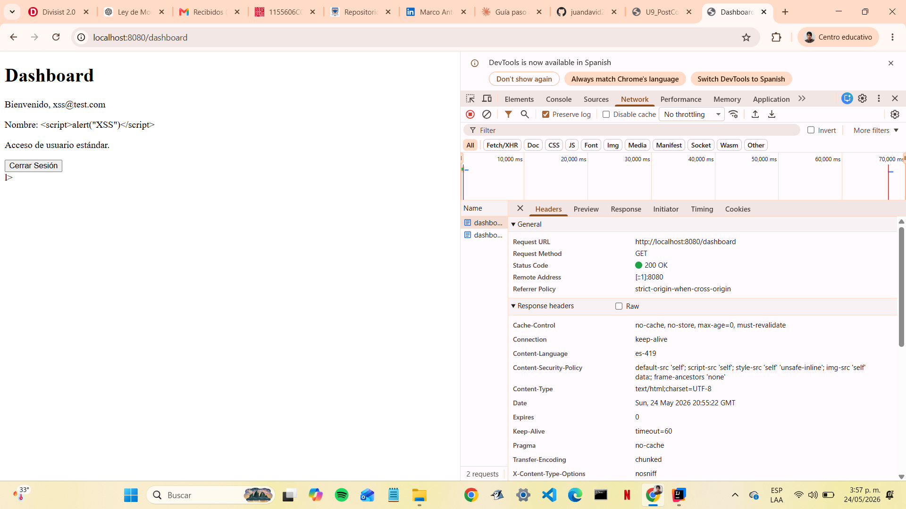
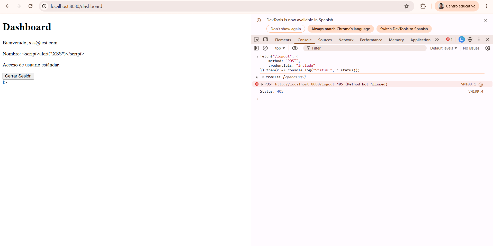

# Laboratorio - Seguridad en Aplicaciones Web
## Unidad 9 - Post-Contenido 2
**Estudiante:** Juan David Pulido  
**Materia:** Programación Web  
**Universidad Francisco de Paula Santander**

---

## Descripción
Verificación activa de protecciones de seguridad: @PreAuthorize, 
mitigación XSS con Thymeleaf, cabecera CSP y protección CSRF.

---

## Pruebas de Seguridad Realizadas

### 1. @PreAuthorize
Se agregaron 4 métodos con @PreAuthorize en UsuarioService:
- `listarTodos()` — solo ADMIN
- `buscarPorEmail()` — ADMIN o el propio usuario
- `cambiarRol()` — solo ADMIN
- `actualizarNombre()` — ADMIN o el propio usuario

**Prueba:** Al intentar acceder a /admin con usuario USER,
Spring Security muestra la página 403 personalizada con el 
mensaje "El usuario juan@prueba.com no tiene permisos para 
acceder a este recurso."

---

### 2. Mitigación XSS con Thymeleaf
Se registró un usuario con nombre: `<script>alert("XSS")</script>`

**Resultado:** Thymeleaf con th:text escapó el contenido y mostró 
el texto literal en el dashboard sin ejecutar el script.
El HTML generado fue: `&lt;script&gt;alert(&quot;XSS&quot;)&lt;/script&gt;`

---

### 3. Content-Security-Policy
Se configuró el CSP header en SecurityConfig:
- default-src 'self'
- script-src 'self'
- style-src 'self' 'unsafe-inline'
- img-src 'self' data:
- frame-ancestors 'none'

**Verificación:** El header fue confirmado en Chrome DevTools 
→ Network → Response Headers → Content-Security-Policy.

---

### 4. Protección CSRF
Se intentó enviar POST a /logout sin token CSRF desde la consola:
```javascript
fetch("/logout", {method: "POST"})
.then(r => console.log("Status:", r.status));
```
**Resultado:** Spring Security respondió 405 Method Not Allowed,
rechazando la petición sin token CSRF válido.

---

## Usuarios de prueba
| Rol | Email | Contraseña |
|-----|-------|------------|
| ADMIN | admin@universidad.edu | admin123 |
| USER | juan@test.com | 1234 |
| XSS test | xss@test.com | 1234 |

---

## Capturas
### 1. @PreAuthorize
Se agregaron 4 métodos con @PreAuthorize en UsuarioService...

**Prueba:** Al intentar acceder a /admin con usuario USER...



---

### 2. Mitigación XSS con Thymeleaf
Se registró un usuario con nombre: `<script>alert("XSS")</script>`



---

### 3. Content-Security-Policy
Se configuró el CSP header en SecurityConfig...



---

### 4. Protección CSRF
Se intentó enviar POST sin token CSRF...

